# 🛡️ InfoShield AI: Disaster Information Verification System

> A multi-agent system built with Google Agent Development Kit (ADK) for real-time disaster query verification with Human-in-the-Loop support.

[](https://www.python.org/downloads/)
[](https://google.github.io/adk-docs/)
[](LICENSE)

## 🎯 Overview

InfoShield AI is a **Hub-and-Spoke Agentic Architecture** designed to handle disaster-related queries from users. It evaluates urgency, verifies information using real-time web search, and incorporates a Human-in-the-Loop mechanism for ambiguous cases.

### Key Features

- 🔍 **Real-time Verification**: Uses Google Search to verify disaster reports against news and official sources
- 📊 **Credibility Scoring**: Calculates a credibility score (0-100) based on source reliability
- 🚨 **Urgency Detection**: Sentiment analysis with urgency scoring (1-10)
- 👥 **Human-in-the-Loop**: Routes low-confidence queries to human experts
- 🌤️ **Weather Context**: Fetches weather data to provide situational awareness
- 📱 **SMS Ready**: Architecture designed for future Twilio integration

## 🏗️ Architecture


### Multi-Agent Architecture

The system uses a **Hub-and-Spoke** pattern where the Orchestrator delegates tasks to specialized agents:

- **Orchestrator**: Manages the workflow and final response generation.
- **Analyzer Agent**: Uses `analyze_query` to extract intent and urgency.
- **Search Agent**: Uses `google_search` to find real-time information.
- **Credibility Agent**: Uses `calculate_credibility` to score the findings.

## 🔄 Workflow

```mermaid
---
config:
  layout: elk
---
flowchart TB
    n1["User Query"] --> B["Analyze Query"]
    B -- Sentiment, Urgency, Location --> C["Fetch Weather"]
    C -- Current Conditions --> D["Search & Verify"]
    D -- News, Official Sources --> E["Calculate Score"]
    E -- Credibility % --> F{"Decision Engine"}
    F -- Urgency ≥ 8 --> G["🚨 IMMEDIATE RESPONSE"]
    F -- Credibility ≥ 60% --> H["✅ AUTOMATED RESPONSE"]
    F -- Credibility < 60% --> I["📝 HUMAN VERIFICATION"]
    I --> J["Save to CSV"]
    J --> K["Expert Reviews"]
    K --> L["SMS to User"]

    n1@{ icon: "fa:user", pos: "b"}

```



## 📦 Installation

### Prerequisites

- Python 3.11+
- [UV](https://docs.astral.sh/uv/) package manager
- Google AI Studio API Key

### Setup

```powershell
# Clone the repository
git clone https://github.com/yourusername/infoshield-ai.git
cd infoshield-ai

# Create virtual environment with UV
uv venv
.\.venv\Scripts\Activate.ps1

# Install dependencies
uv sync

# Configure API key
# Create .env file with your Google API key
echo "GOOGLE_API_KEY=your_api_key_here" > .env
```

### Get Your API Key

1. Go to [Google AI Studio](https://aistudio.google.com/app/apikey)
2. Create a new API key
3. Copy it to your `.env` file

## 🚀 Quick Start

```powershell
# Activate virtual environment
.\.venv\Scripts\Activate.ps1

# Run the system
python runner.py
```

### Example Queries

```python
# High urgency - Immediate response
"Help! There's flooding in my area in Chennai, water is entering houses!"

# Verification needed
"Is there a tsunami warning for Mumbai coast?"

# General information
"What should I do to prepare for a hurricane?"

# Low credibility - Human verification
"Aliens are attacking the city center!"
```

## 📂 Project Structure

```
InfoShield_AI/
├── infoshield_ai/                    # Main package
│   ├── __init__.py                   # Package initialization
│   ├── agent.py                      # Single-agent mode definition
│   ├── config.py                     # Configuration constants
│   ├── models.py                     # Pydantic/dataclass models
│   ├── agents/                       # Multi-agent orchestration
│   │   ├── __init__.py
│   │   ├── orchestrator.py           # SequentialAgent coordinator
│   │   ├── analyzer_agent.py         # Query analysis agent
│   │   ├── search_agent.py           # Web search agent
│   │   ├── credibility_agent.py      # Credibility scoring agent
│   │   └── runner.py                 # Multi-agent runner
│   └── tools/                        # Custom function tools
│       ├── __init__.py
│       ├── analyzer.py               # Query analysis tool
│       ├── credibility.py            # Credibility scoring
│       └── human_review.py           # Human-in-loop storage
│
├── data/                             # Data storage
│   └── pending_verifications.csv     # Human review queue
│
├── runner.py                         # Entry point
├── pyproject.toml                    # Dependencies
├── .env                              # API keys (not in git)
└── README.md                         # This file
```

## 🔧 Configuration

### Thresholds (in `config.py`)

| Threshold               | Value | Description                                       |
| ----------------------- | ----- | ------------------------------------------------- |
| `URGENCY_THRESHOLD`     | 8     | Urgency score >= this triggers immediate response |
| `CREDIBILITY_THRESHOLD` | 60    | Credibility % >= this enables automated response  |
| `SESSION_TTL_DAYS`      | 15    | Days before session data expires (future Redis)   |

### Environment Variables

| Variable                    | Required | Description                            |
| --------------------------- | -------- | -------------------------------------- |
| `GOOGLE_API_KEY`            | Yes      | Google AI Studio API key               |
| `GOOGLE_GENAI_USE_VERTEXAI` | No       | Set to "False" for AI Studio (default) |

## 🛠️ Technical Stack

| Component | Technology               | Purpose                      |
| --------- | ------------------------ | ---------------------------- |
| AI Engine | Gemini 2.5 Flash         | LLM for reasoning and search |
| Framework | Google ADK               | Agent orchestration          |
| Search    | Google Search (built-in) | Real-time web verification   |
| Storage   | CSV (temporary)          | Human verification queue     |
| Runtime   | Python asyncio           | Async execution              |

## 🗺️ Roadmap

### Phase 1: Core System ✅

- [x] Query evaluation with sentiment analysis
- [x] Real-time web search verification
- [x] Credibility scoring
- [x] Human-in-the-loop queue

### Phase 2: Communication 🔄

- [ ] Twilio SMS integration
- [ ] Voice call support (Twilio)
- [ ] Multi-language support

### Phase 3: Expert Dashboard

- [ ] Streamlit dashboard for human reviewers
- [ ] Session management UI
- [ ] Analytics and metrics

### Phase 4: Production

- [ ] FastAPI backend
- [ ] PostgreSQL for structured data
- [ ] Redis for session caching
- [ ] Cloud Run deployment

### Phase 5: Advanced Features

- [ ] Authority integration (NDRF, FEMA, etc.)
- [ ] Live rescue unit mapping
- [ ] Satellite connectivity requests
- [ ] Automated drone dispatch for thermal imaging
- [ ] Post-disaster body detection reporting

## ⚠️ Limitations & Considerations

### Technical Limitations

1. **Not a 911/112 Replacement**: This is an information system, not emergency dispatch
2. **Internet Dependency**: Requires internet connectivity (no offline mode)
3. **Near Real-Time**: Verification has inherent latency (seconds to minutes)
4. **API Rate Limits**: Google Search has usage quotas

### Known Constraints

- Built-in tools can only be used at root agent level (ADK limitation)
- Single API key model (no multi-tenant support yet)
- CSV storage is temporary (not suitable for production scale)

## 🤝 Contributing

1. Fork the repository
2. Create your feature branch (`git checkout -b feature/AmazingFeature`)
3. Commit your changes (`git commit -m 'Add some AmazingFeature'`)
4. Push to the branch (`git push origin feature/AmazingFeature`)
5. Open a Pull Request

## 📄 License

This project is licensed under the MIT License - see the [LICENSE](LICENSE) file for details.

## 🙏 Acknowledgments

- [Google Agent Development Kit](https://google.github.io/adk-docs/)
- [Kaggle 5 Days of AI Course](https://www.kaggle.com/competitions/agents-intensive-capstone-project)
- Disaster management agencies worldwide

## 📞 Disclaimer

> **Important**: This AI system is for informational purposes only. For life-threatening emergencies, always contact local emergency services (911, 112, etc.) directly. The AI cannot dispatch emergency responders.

---

Built with ❤️ using Google ADK | [Report Bug](../../issues) | [Request Feature](../../issues)
